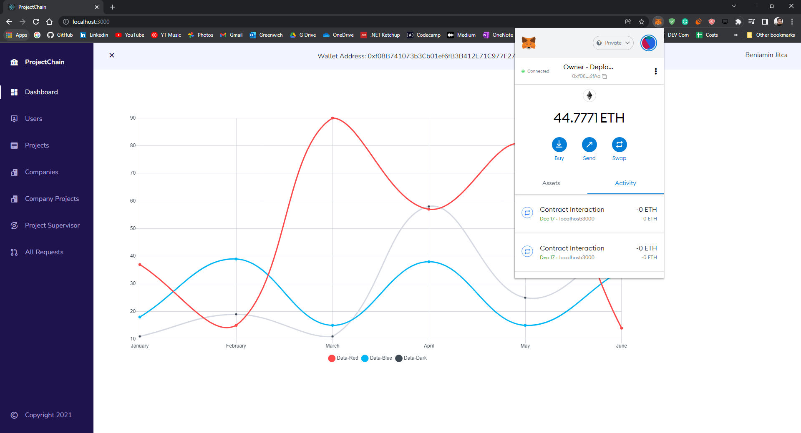

# MSc Computer Science - Dissertation Project
 

  

* `This repository does not have a license. EDUCATION USE ONLY`

* <strike>This application use Pinata for IPFS File, create a .env file and add the keys.</strike>

* File storage was moved to Ipfs Infura using ipfs-http-client.
* The files stored in IPFS are public. The security of the files is not important, they represent mainly public project files. (For a security approach - the files can be encrypted before pinning it to the IPFS Service)
